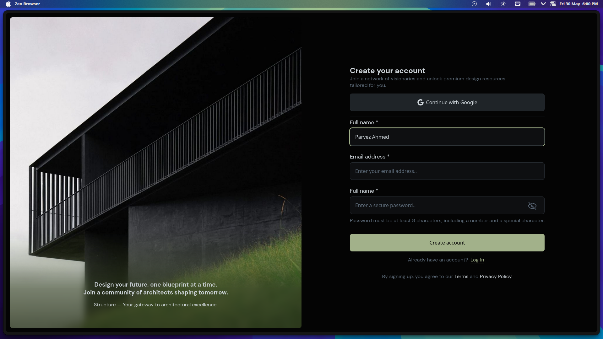

# ✨ Pure HTML & CSS Signup UI

A modern, elegant **Signup Page** UI built completely with **only HTML and CSS** — no frameworks, no libraries — just raw, semantic code based on a visual reference. 🎯



## 🔧 Tech Stack

- ✅ **HTML5**
- ✅ **CSS3**
- 🚫 No JavaScript
- 🚫 No external libraries or frameworks

---

## 📌 Features

- 🌑 **Dark-mode aesthetic**
- 🧩 Fully responsive structure (if applicable)
- 🖼️ Side-by-side layout with visual and form split
- 🔒 Password visibility toggle icon styled
- 🧼 Clean and minimalist design

---

## 🚀 How to Use

1. Clone the repository  
   ```bash
   git clone https://github.com/asianprogrammer/Login.git signUp_UI
   cd signUp_UI
   ```